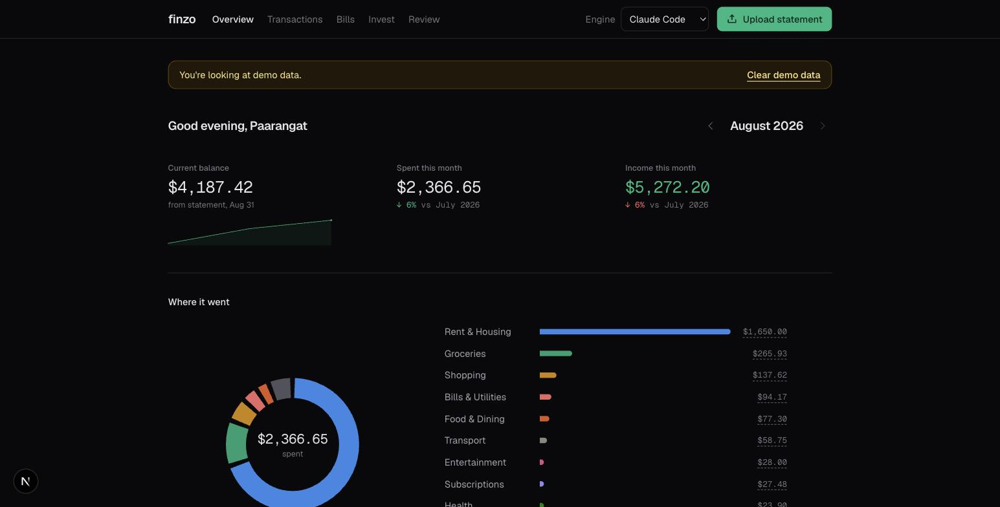
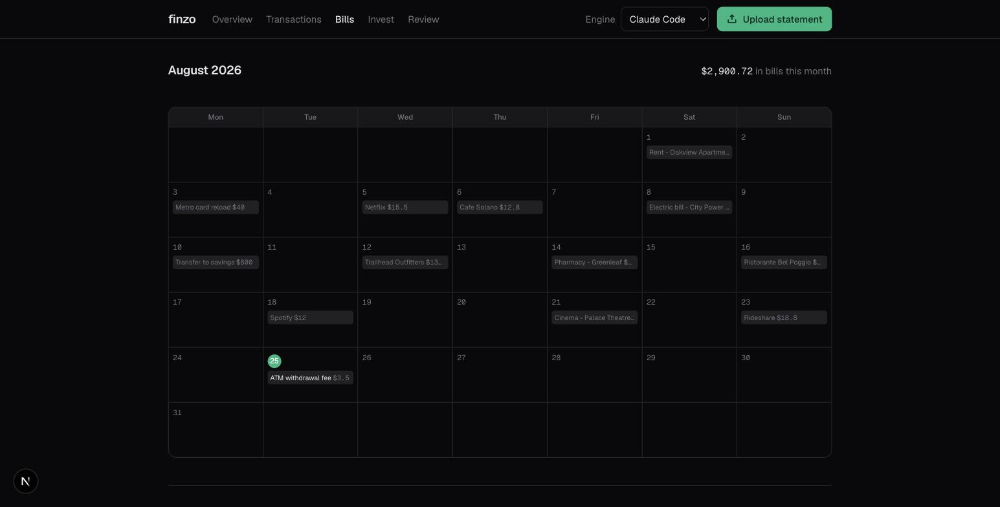
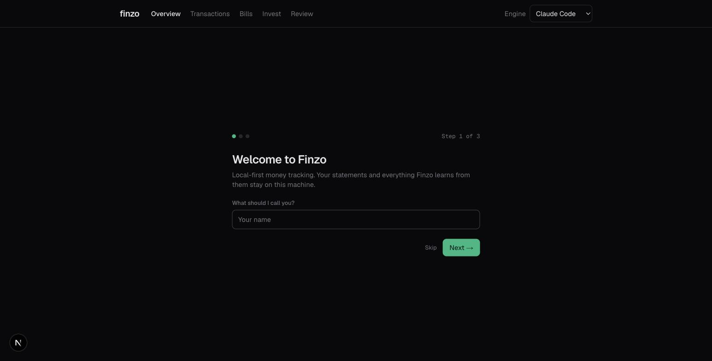

# Finzo

Local-first personal finance tracking, powered by the AI subscription you already have.

Upload a bank statement (PDF or CSV). Finzo uses your own **Claude Code** or **Codex** CLI to extract every transaction, categorize it, and turn it into a dashboard you actually want to look at: balance, cash flow, category breakdown, upcoming bills, budgets, investments, and a check against the classic money rules.

No accounts, no sign-up, no server. A SQLite file on your disk.



## What's in it

**Overview** — balance with a sparkline, spend and income with month-over-month deltas, category donut and bars against your budgets, cash-flow and daily-spend charts, recurring charges, and a portfolio summary.

**Transactions** — month-filtered table with search (and per-merchant totals), inline recategorization, manual add/edit/delete, splitting one transaction across categories, and bulk recategorize with undo.

**Bills** — a calendar of this month's projected due dates, derived from detected recurring charges, with manual include/exclude overrides.



**Invest** — import an Indian Consolidated Account Statement (CAMS / KFintech / NSDL) and Finzo matches each mutual fund to its AMFI scheme code and reprices your units from the free daily NAV feed.

**Review** — a swipe deck for the transactions the engine wasn't sure about. Every choice you make becomes a rule, and past transactions from the same merchant get recategorized too.

**Rules of thumb** — 50/30/20, rent under 30%, a 3–6 month cushion, 100 − age in equity. Graded against your real spending once you've set a take-home salary.

**Also** — multiple accounts with a switcher, monthly category budgets, CSV/JSON export, and a demo mode with fictional data so you can look around before trusting it with anything.

## How it works

- Finzo runs entirely on your machine: a Next.js app with a local SQLite database (`data/finzo.db`).
- When you upload a statement, Finzo shells out to the `claude` or `codex` CLI in headless mode with a strict JSON extraction prompt. Your subscription pays for the tokens; no API keys needed.
- The response is schema-validated (Zod) and written to SQLite atomically. Bad output never corrupts your data.
- Duplicate files are rejected, and identical transactions across overlapping statements are deduplicated.

## Privacy — what leaves your machine

Finzo has no analytics, no telemetry, no error reporting, no accounts, and no auth. There are exactly three ways anything leaves this machine, and you should know all three:

1. **The AI CLI you chose.** Your statement's contents are passed to `claude` or `codex`, which sends them to Anthropic or OpenAI under your own subscription and their terms. This is the real one — if a statement is too sensitive for that, don't upload it. The `fixture` engine and demo mode make no network calls at all.
2. **`api.mfapi.in`**, a free mirror of AMFI's daily NAV feed, used only on the Invest page and during CAS import. It receives **public mutual-fund scheme names** — never your units, values, holdings, or anything identifying. It has an 8-second timeout and fails silently; prices just go stale.
3. **Google Fonts, at build time only.** `next/font/google` downloads Geist during `npm run build` and self-hosts it. The running app makes no font requests.

Nothing else. `git grep "https\?://" lib app components` is a short list, and you're welcome to check.

## Where your data lives

Everything is under `data/`, which is gitignored:

- `data/finzo.db` — SQLite (WAL mode). Transactions, accounts, budgets, category rules, investments, settings.
- `data/uploads/` — the statement and CAS files you uploaded, kept verbatim for re-processing.

To start over, delete `data/`. To back up, copy it. To move machines, move it.

## Quickstart

You need Node.js 22+ (`better-sqlite3` requires it) and at least one AI CLI signed in with your subscription:

```bash
npm install -g @anthropic-ai/claude-code   # then: claude (sign in)
# or
npm install -g @openai/codex               # then: codex (sign in)
```

Then:

```bash
git clone https://github.com/paarangat/finzo.git
cd finzo
npm install
npm run dev
```

Open http://localhost:3000. Finzo asks your name, then takes a statement.



No subscription? Pick the **Fixture (demo)** engine in the top bar, or hit "explore with demo data" during onboarding.

*(All screenshots use demo data — fictional merchants and amounts.)*

## Configuration

- **Engine**: switch between Claude Code and Codex in the top bar (or set `FINZO_ENGINE=claude|codex|fixture`). This is the only environment variable Finzo reads.
- **Balance**: taken from the statement's closing balance automatically; click the balance stat to enter it manually. The fresher of the two wins.
- **Salary, currency, age**: set during onboarding, editable from the dashboard. Currency formats numbers — it never converts them.
- **Categories**: a fixed set (Food & Dining, Groceries, Transport, ...). Recategorize any transaction inline; Finzo remembers the merchant.

## Development

```bash
npm test        # unit tests (schema, store, summary math, rules) — no AI needed
npm run lint
npm run build
```

The fixture engine (`lib/engines/fixture.ts`) lets you develop and test the whole flow without an AI subscription.

See [CONTRIBUTING.md](CONTRIBUTING.md) for the architecture, how to add an engine or a category, and the conventions to follow.

## License

MIT — see [LICENSE](LICENSE).
